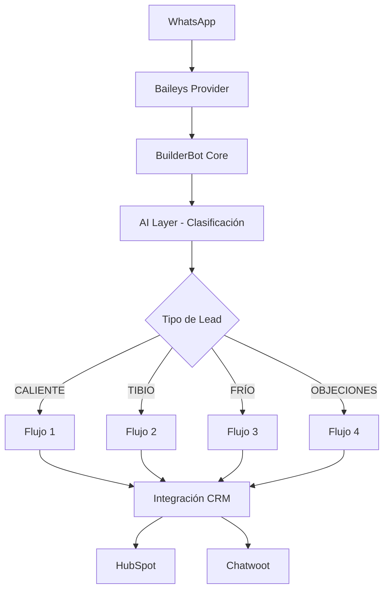

# 🤖 Agenteia - Bot Inteligente para Educación

<p align="center">
  
  
  
  
  
</p>

LuzIA es una asistente virtual inmobiliaria, amigable y experta, especializada en la automatización de conversaciones para WhatsApp. Su objetivo es ayudar a los usuarios a encontrar su propiedad ideal, generar informes de proyectos recomendados y gestionar la disponibilidad de citas de manera inteligente.

## 🌟 Características Principales

### 🚀 **Automatización Inteligente**
- **Clasificación de leads** con IA para entender las necesidades del cliente.
- **Flujo conversacional único** y adaptativo para guiar al usuario.
- **Generación de 3 informes** de proyectos personalizados.
- **Validación en tiempo real** de disponibilidad para citas.

- **4 flujos conversacionales** adaptativos según el nivel de interés
- **Scoring dinámico** de prospectos en tiempo real
- **Gestión de recordatorios** automáticos

### 🎯 **Flujos Especializados**
- **Flujo 1 (CALIENTE)**: Para usuarios listos para comprar o solicitar asesoría
- **Flujo 2 (TIBIO)**: Calificación completa con preguntas estructuradas  
- **Flujo 3 (FRÍO)**: Información básica y captación de interés
- **Flujo 4 (OBJECIONES)**: Manejo de desconfianza y aclaración de dudas

### 🔗 **Integraciones CRM**
- **HubSpot**: Sincronización automática de contactos y propiedades
- **Chatwoot**: Centro de atención al cliente integrado
- **WhatsApp Business**: Comunicación nativa vía Baileys

### 🛡️ **Seguridad y Escalabilidad**
- **Sistema de colas** para procesamiento ordenado
- **Manejo de sesiones** persistente y seguro
- **Health checks** y monitoreo automático
- **Rate limiting** y control de concurrencia

## 🏗️ Arquitectura del Sistema



## 🚀 Inicio Rápido

### Prerequisitos
- **Node.js** 18+ (recomendado 22+)
- **pnpm** (gestor de paquetes)
- **Docker** (opcional, para containerización)

### Instalación Local

```bash
# Clonar el repositorio
git clone https://github.com/tu-usuario/agenteia-app.git
cd agenteia-app

# Instalar dependencias
pnpm install

# Configurar variables de entorno
cp .env.example .env
# Editar .env con tus credenciales

# Compilar el proyecto
pnpm run build

# Iniciar en desarrollo
pnpm run dev

# Iniciar en producción
pnpm start
```

### 🐳 Instalación con Docker

```bash
# Construir la imagen
docker build -t agenteia-app .

# Ejecutar el contenedor
docker run -d \
  --name agenteia-bot \
  -p 3008:3008 \
  --env-file .env \
  agenteia-app

# Ver logs
docker logs -f agenteia-bot
```

### 📋 Variables de Entorno

Crear un archivo `.env` con las siguientes variables:

```env
# Configuración del servidor
PORT=3008
BOT_URL=https://tu-dominio.com

# Configuración de IA (OpenAI o Google AI)
MODEL=gpt-4
API_KEY=tu_api_key_aqui

# HubSpot CRM
HUBSPOT_TOKEN=tu_hubspot_token
HUBSPOT_ENDPOINT=https://api.hubapi.com

# Chatwoot (Centro de atención)
ACCOUNT_ID=tu_account_id
CHATWOOT_TOKEN=tu_chatwoot_token
CHATWOOT_ENDPOINT=https://tu-chatwoot.com
INBOX_NAME=WhatsApp Bot
```

## 📊 Flujos de Conversación

### 🔥 **Flujo 1 - CALIENTE (Alta Prioridad)**
**Triggers:**
- Usuario solicita hablar con asesor
- Expresa intención inmediata de estudiar
- Solicita información para inscripción

**Acciones:**
- Recopilación rápida de datos básicos
- Programación inmediata de llamada
- Alta prioridad en CRM (Score: Alto)

### 🌡️ **Flujo 2 - TIBIO (Calificación Completa)**
**Triggers:**
- Usuario muestra interés general
- Responde positivamente a preguntas iniciales
- No solicita asesoría inmediata

**Acciones:**
- Cuestionario completo de calificación (10 pasos)
- Invitación a webinar gratuito
- Scoring basado en respuestas
- Programación de seguimiento

### ❄️ **Flujo 3 - FRÍO (Información Básica)**
**Triggers:**
- Primera interacción
- Consultas generales sobre carreras
- Usuario no califica para otros flujos

**Acciones:**
- Información básica de carreras
- Costos y beneficios generales
- Recopilación mínima de datos
- Invitación suave a continuar

### 🛡️ **Flujo 4 - OBJECIONES (Manejo de Desconfianza)**
**Triggers:**
- Usuario expresa desconfianza ("estafa", "no confío")
- Confusión sobre nombres de carreras
- Solicita validación legal

**Acciones:**
- Aclaración de ofertas académicas
- Datos legales (RUC, MINEDU)
- Refutación de objeciones
- Reconducción a calificación

## 🔧 Scripts Disponibles

```bash
# Desarrollo con hot-reload
pnpm run dev

# Compilar proyecto
pnpm run build

# Ejecutar en producción
pnpm start

# Linting de código
pnpm run lint
```

## 🛠️ Stack Tecnológico

### **Backend**
- **Node.js 22** - Runtime de JavaScript
- **TypeScript 5.4** - Tipado estático
- **BuilderBot 1.2.9** - Framework de chatbots
- **Baileys 6.7** - Cliente WhatsApp

### **IA y Procesamiento**
- **OpenAI GPT-4** - Modelo de lenguaje principal
- **Google Generative AI** - Modelo alternativo
- **Queue Promise** - Cola de procesamiento

### **Integraciones**
- **HubSpot API** - CRM de ventas
- **Chatwoot API** - Centro de atención

### **DevOps**
- **Docker** - Containerización optimizada
- **Rollup** - Bundler de producción
- **Nodemon** - Hot reload en desarrollo
- **ESLint** - Linting de código

## 📈 Métricas y Monitoreo

### **Health Checks**
```bash
# Verificar estado del bot
curl http://localhost:3008/v1/health

# Respuesta esperada
{"status":"ok"}
```

### **Endpoints de Control**
```bash
# Agregar número a blacklist
POST /v1/blackList
{
  "number": "573001234567",
  "intent": "add"
}

# Remover de blacklist
POST /v1/blackList
{
  "number": "573001234567", 
  "intent": "remove"
}
```

### **Logging y Debugging**
- Logs estructurados con **Pino**
- Tracking de flujos por usuario
- Métricas de conversión por flujo
- Monitoreo de performance de IA

## 🤝 Contribución

### **Estructura del Proyecto**
```
src/
├── app.ts              # Punto de entrada principal
├── config/             # Configuración de variables
├── flows/              # Flujos conversacionales
├── layers/             # Capas de procesamiento
├── prompts/            # Prompts de IA especializados
├── services/           # Integraciones externas
└── utils/              # Utilidades y helpers
```

### **Contribuir al Proyecto**
1. Fork del repositorio
2. Crear rama feature (`git checkout -b feature/nueva-funcionalidad`)
3. Commit de cambios (`git commit -am 'Agrega nueva funcionalidad'`)
4. Push a la rama (`git push origin feature/nueva-funcionalidad`)
5. Crear Pull Request

## 📄 Licencia

Este proyecto está licenciado bajo la Licencia ISC - ver el archivo [LICENSE](LICENSE) para más detalles.

## 📞 Soporte

- **Email**: soporte@agenteia.com
- **Discord**: [Únete a nuestro servidor](https://discord.gg/agenteia)
- **Documentación**: [Wiki del proyecto](https://github.com/tu-usuario/agenteia-app/wiki)

---

<p align="center">
  Desarrollado con ❤️ por el equipo de Agenteia
</p>
